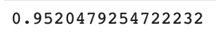
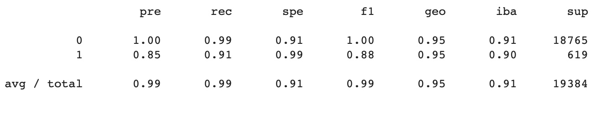
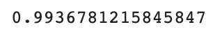
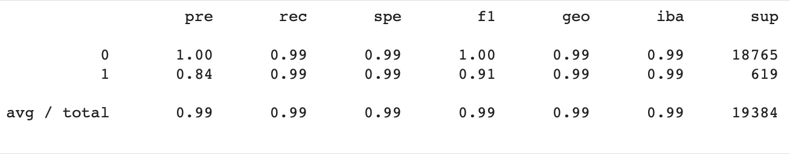

# Module 12 Report Template

## Overview of the Analysis

  > Use various techniques to train and evaluate models with imbalanced calsses and that model can identify the creditworthiness of borrowers   
  ---
  > Finacial infomation includes:   
    * loan_size   
    * interest rate   
    * borrower income   
    * debt_to_income_ratio
    * number_of_accounts   
    * derogatory_marks   
    * total debts   

  > technology used:   
```python
   value_counts   
   LogisticRegression   
   sklearn.model_selection.train_test_split   
   sklearn.linear_model.LogisticRegression   
   sklearn.metrics.classification_report   

```    

## Results

   
   
* Machine Learning Model 1:
  * Description of Model 1 Accuracy, Precision, and Recall scores.   
  * Model1 is the original machine learning model   
  * The accuracy_score of this model is very high at 0.95204   
  * The model use original data has a high precise at 0.85   
  * The model use original data has a high recall value at 0.91

---
---
   
   
* Machine Learning Model 2:
  * Description of Model 2 Accuracy, Precision, and Recall scores.   
  * Model1 is the resemple machine learning model   
  * The accuracy_score of this model is extremly high at 0.9936   
  * The model use resemple data has a high precise at 0.84   
  * The model use resemple data has a high recall value at 0.99

## Summary

Summarize the results of the machine learning models, and include a recommendation on the model to use, if any. For example:
* Which one seems to perform best? How do you know it performs best?
* Does performance depend on the problem we are trying to solve? (For example, is it more important to predict the `1`'s, or predict the `0`'s? )

   >  Both Model predict an acceptable high accuracy result. Especially on the 1 class, which is high risk group of people. However, since the resampling model has a extremly higher accuracy score which is at 99.36% and the same model always work better on recall matrixs which is 99%, we highly recommand that using imbalanced resampling is better.   
   
